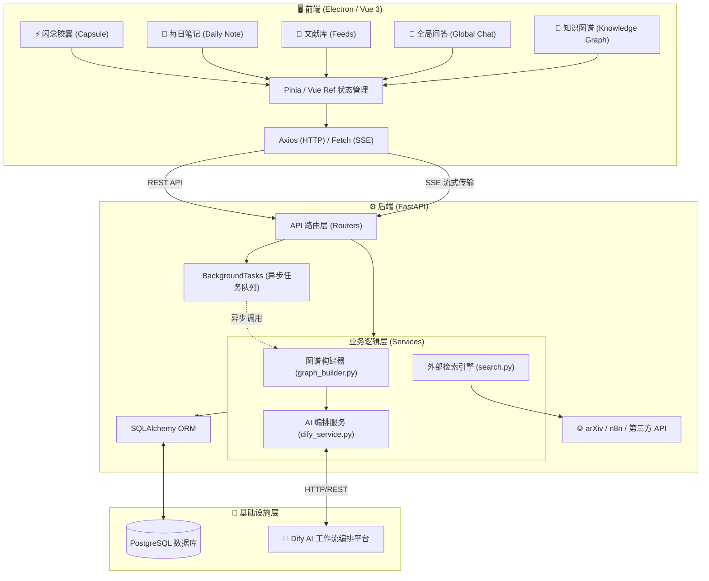
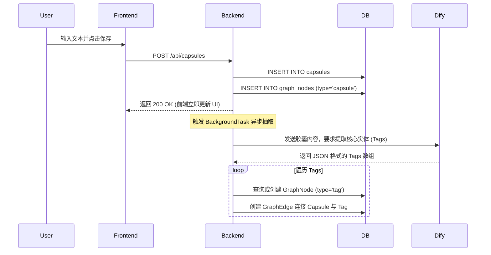
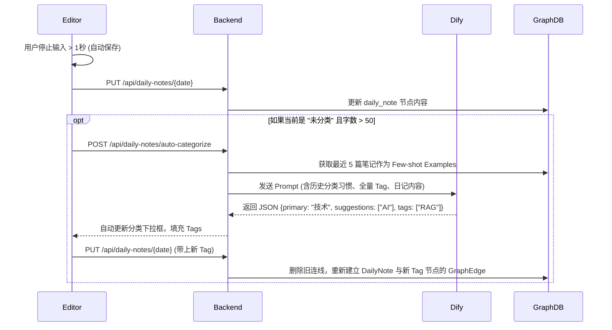
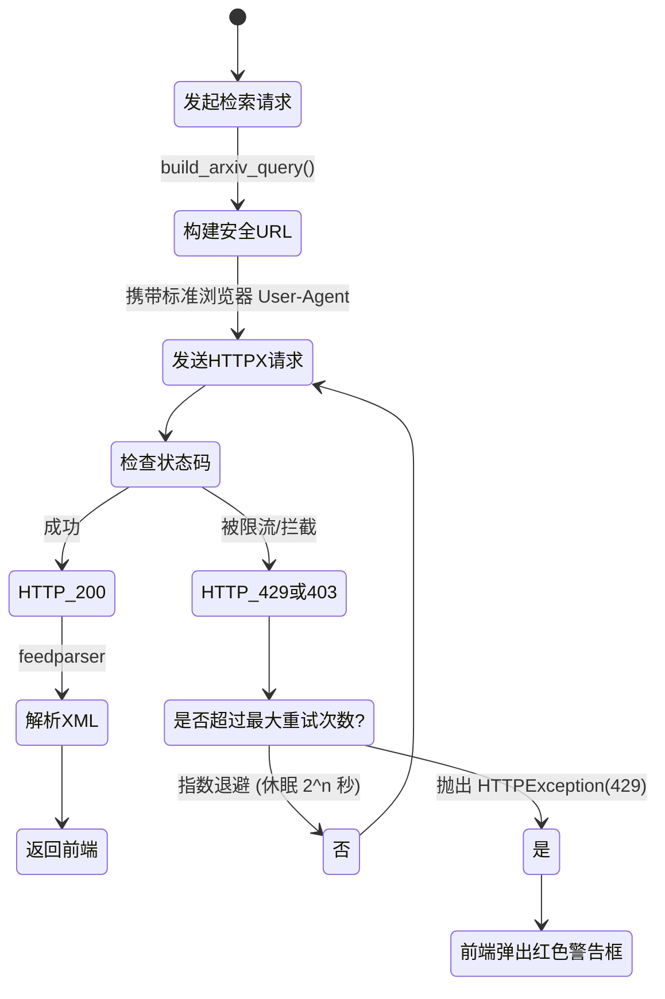

# InsightGraph 桌面端应用 - 详尽项目文档

## 1. 项目概览 (Project Overview)

**InsightGraph** 是一款基于大语言模型（LLM）的“第二大脑”桌面端知识管理软件。它不仅是一个本地的笔记与文献阅读工具，更通过深度的 AI 集成，构建了一个能够自动从碎片化信息中提取知识、建立关联的个人知识图谱系统。

项目的核心工作流是：**收集碎片 (Capsule) -> 沉淀文献 (Feed) -> 日常创作 (Daily Note) -> 全局关联 (Graph) -> 智能问答 (Global Chat)**。

---

## 2. 项目架构与技术栈 (Architecture & Tech Stack)

### 2.1 技术栈 (Tech Stack)

**前端 (Frontend)**
- **核心框架**: Vue 3 (Composition API) + TypeScript
- **构建工具**: Vite
- **UI 组件库**: Element Plus
- **CSS 框架**: Tailwind CSS
- **桌面端环境**: Electron + Electron-builder (适配 macOS / Windows)
- **路由管理**: Vue Router
- **可视化图表**: Apache ECharts (用于知识图谱物理引擎渲染)
- **Markdown 引擎**: ByteMD (支持 GFM、代码高亮)、Marked + DOMPurify
- **HTTP 客户端**: Axios

**后端 (Backend)**
- **核心框架**: FastAPI (Python 3.11)
- **数据库**: PostgreSQL (使用 SQLAlchemy ORM)
- **AI 编排引擎**: Dify API (对接本地大模型工作流，涵盖 Chat、Workflow、Dataset 等接口)
- **网络请求**: HTTPX, aiohttp (用于全异步的非阻塞网络请求)
- **容器化部署**: Docker + Docker Compose

### 2.2 目录结构 (Directory Structure)

```text
InsightGraph/
├── frontend/                     # 前端工程
│   ├── src/
│   │   ├── assets/               # 静态资源 (含优化后的桌面端图标)
│   │   ├── components/           # Vue 公共组件
│   │   ├── router/               # Vue Router 路由配置
│   │   └── views/                # 视图层页面 (Capsule, DailyNote, Feed, Graph, GlobalChat)
│   ├── electron/                 # Electron 主进程入口 (main.js, preload.js)
│   └── package.json              # 前端依赖及 Electron-builder 打包配置
└── backend/                      # 后端工程
    ├── app/
    │   ├── core/                 # 数据库连接 (database.py)
    │   ├── models/               # SQLAlchemy 数据表模型
    │   ├── routers/              # FastAPI 路由控制器
    │   └── services/             # 业务逻辑服务 (dify_service.py, graph_builder.py)
    ├── main.py                   # FastAPI 应用入口点
    └── requirements.txt          # Python 依赖清单
```

### 2.3 系统架构图 (Architecture Diagram)



---

## 3. 核心功能模块详解 (Functional Modules)

### 3.1 闪念胶囊 (Capsule)
- **功能**: 用于快速捕捉瞬间的灵感、网页摘录或零碎文本。
- **核心交互图**:


### 3.2 每日笔记 (Daily Note)
- **功能**: 提供类似 Obsidian/Typora 的沉浸式日记写作体验，支持 AI 自动分类、Tag 预生成，以及基于原文的深度 AI 创作。
- **AI 自动分类与 Tag 抽取时序图**:


- **AI 魔法重写 (AI Rewrite) 逻辑图**:
```mermaid
flowchart LR
    A[用户点击 AI 创作] --> B{解析草稿内容}
    B -->|包含 [[original:123]]| C[查询 feed_items 表的 full_text]
    B -->|包含 [[capsule:456]]| D[查询 capsules 表的 content]
    B -->|纯文本| E[直接使用选中文本]
    
    C --> F[组装结构化 Prompt]
    D --> F
    E --> F
    
    F[将上下文包裹进 XML 标签发送至 Dify] --> G[建立 SSE 连接]
    G -->|流式返回| H[前端打字机效果逐字渲染]
```

### 3.3 文献阅读库 (Feed/Reader & Search)
- **功能**: 订阅、搜索外部长篇文献（如 arXiv），利用大模型进行快速泛读 (Skim) 与深度精读 (Deep)。
- **文献检索与防屏蔽机制**:


### 3.4 全局智能问答 (Global Chat)
- **功能**: 基于用户的整个知识库（胶囊、笔记、文献）进行自然语言问答，并提供引用来源。支持消息编辑、重新生成、随时中止。
- **流式对话与溯源架构**:
```mermaid
graph TD
    A[用户提问] -->|fetch (SSE)| B[FastAPI 后端]
    B -->|透传请求| C[Dify 工作流 (Knowledge Base Retrieval)]
    
    C -->|chunk: text| B
    B -->|SSE: message| D[前端打字机渲染]
    
    C -->|chunk: message_end| B
    B -->|提取 retriever_resources| E[解析溯源元数据]
    E -->|SSE: citations| D
    D --> F[UI 底部渲染引用气泡]
    
    G[用户点击中止] --> H[AbortController.abort()]
    H --> I[物理掐断 fetch TCP 流]
    I --> J[前后端立刻停止资源消耗]
```

### 3.5 知识图谱星空 (Knowledge Graph)
- **功能**: 以可视化的力导向图展示所有知识点及其关联关系。
- **图谱渲染与连通机制**:
```mermaid
graph TD
    subgraph 数据库核心 (graph_nodes & edges)
        T1((Tag: 大模型))
        T2((Tag: 产品思考))
        
        N1[Capsule: 灵感闪现]
        N2[DailyNote: 4月6日日记]
        N3[Feed: arXiv 论文]
        
        N1 -.->|has_tag| T1
        N2 -.->|has_tag| T1
        N2 -.->|has_tag| T2
        N3 -.->|has_tag| T1
    end

    subgraph 前端 ECharts 物理引擎
        E[拉取全量 Nodes 和 Edges] --> F[配置 repulsion: 200]
        F --> G[按 node_type 映射颜色/大小]
        G --> H[Force Layout 迭代计算引力与斥力]
        H --> I[渲染最终悬浮星空图]
    end
    
    T1 ==> E
```

---

## 6. 数据库结构设计 (Database Schema)

项目使用 PostgreSQL，所有表名和字段由 SQLAlchemy ORM 严格定义：

### 6.1 实体核心表
- **`capsules`** (闪念胶囊)
  - `id` (Integer, PK)
  - `title`, `content` (Text), `file_url`, `created_at`
- **`daily_notes`** (每日笔记)
  - `id` (Integer, PK)
  - `date` (Date, 唯一日期索引)
  - `content` (Text, Markdown 正文)
  - `dify_document_id` (String, 同步到向量库的凭证)
- **`feed_items`** (长篇文献资源)
  - `id` (Integer, PK)
  - `title`, `content` (Text, 抽取正文), `url`, `authors`, `keywords`
  - `full_text` (Text, 完整 PDF/网页原始文本，用于 AI 深度读取)
  - `skim_summary`, `deep_chat_history` (JSON)

### 6.2 图谱计算表 (Graph)
用于支撑知识图谱网络渲染的抽象层：
- **`graph_nodes`** (图谱节点)
  - `id` (Integer, PK)
  - `node_type` (Enum: 'original', 'skim', 'deep', 'capsule', 'daily_note', 'tag')
  - `title` (String, 展示名称)
  - `content` (Text, 节点详情或 Tag 描述)
  - `ref_id` (Integer, 关联的真实实体表 ID，用于点击跳转回原文)
- **`graph_edges`** (图谱关系边)
  - `id` (Integer, PK)
  - `source_node_id` (FK -> graph_nodes.id)
  - `target_node_id` (FK -> graph_nodes.id)
  - `relation_type` (String, 如 'has_tag')

### 6.3 会话表 (Chat)
- **`global_conversations`** (全局会话记录)
  - `id` (Integer, PK)
  - `title` (String, 根据对话首句自动生成)
  - `dify_conversation_id` (String, 关联 Dify 平台的 Thread ID，用于维持远端上下文)
  - `history` (Text, 保存 JSON 格式的消息数组，防止页面切换丢失)

---

## 7. 系统级疑难攻坚记录

1. **macOS 沉浸式桌面体验 (Icon Halo Fix)**: 
   - 解决 Electron 默认打包给 macOS Big Sur 及以上系统图标带有白圈 (White Halo) 的问题。
   - 通过 Python Pillow 进行物理级像素扫描，去除一切 Alpha 透明通道，强制提取边缘像素颜色填充四个角，生成 Full Bleed (全出血) 纯 RGB 图像，使其完美触发苹果官方的 Squircle (圆角矩形) 遮罩。
2. **多源异步知识抽取 (Async Graph Build)**: 
   - 系统在保存数据的同时，利用 FastAPI 的 `BackgroundTasks` 异步调用 LLM 抽取实体。这保证了前端 UI 录入数据的毫秒级响应，而需要长达数十秒的 LLM 推理和图谱边构建则在后台静默完成。
3. **强大的 AI 编辑上下文穿透 (Deep Context Assembly)**: 
   - `Daily Note` 的 AI 写作工具突破了常规总结工具的限制。当检测到 `[[original:id]]` 双链时，FastAPI 后端会去数据库中提取包含数万字符的 `full_text` 字段发送给大模型，让大模型真正“阅读过”原典后再辅助用户写作。