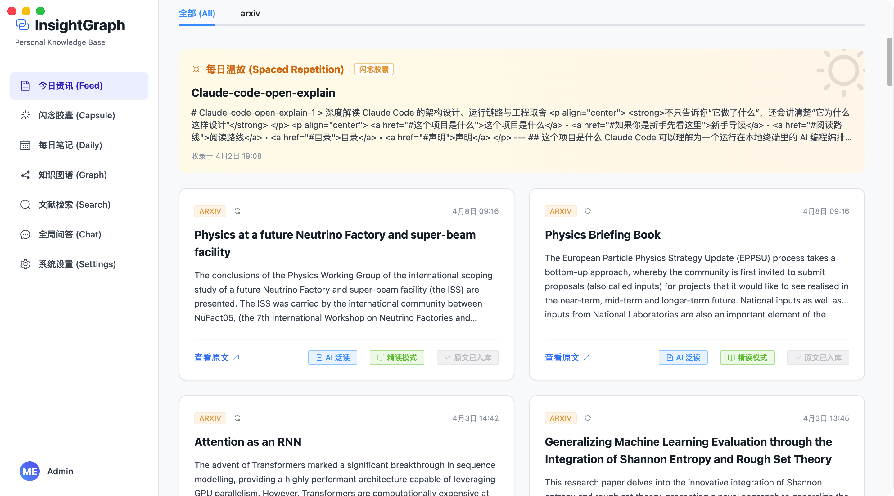
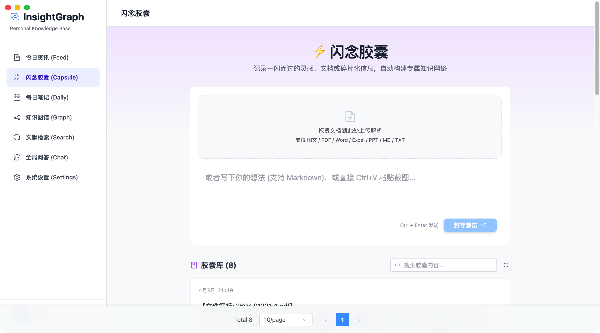
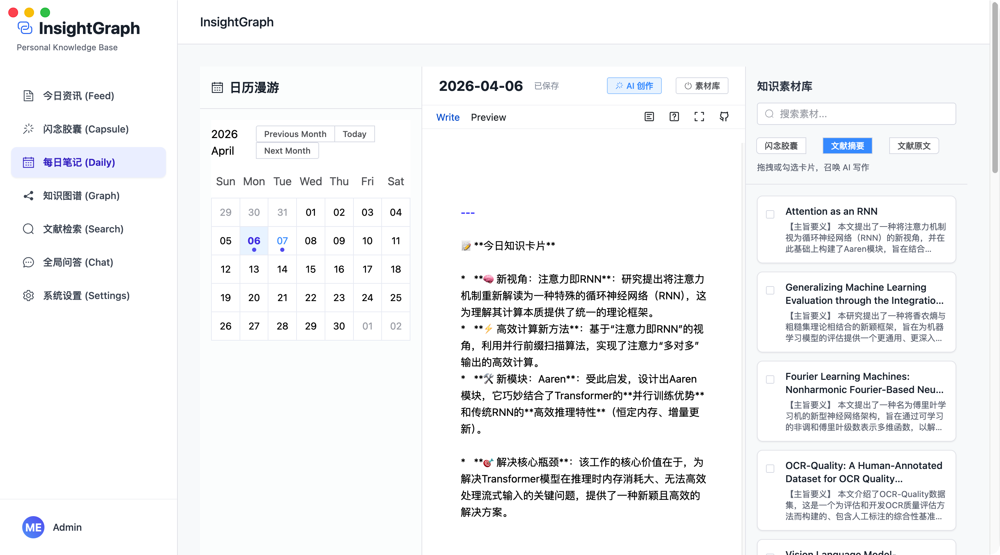
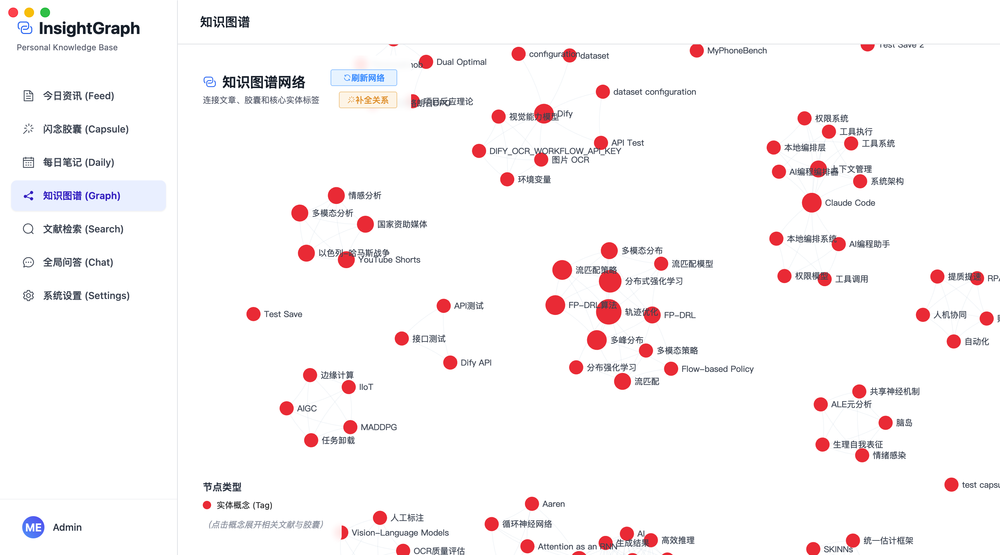
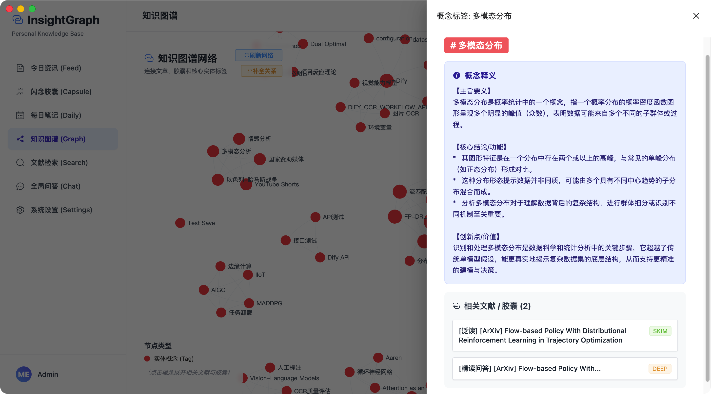
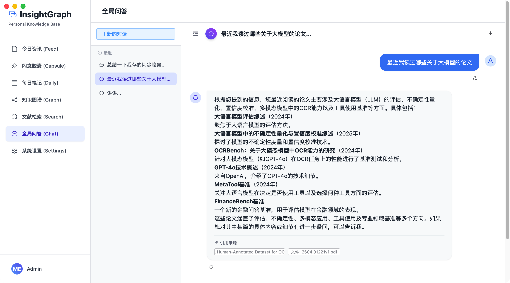
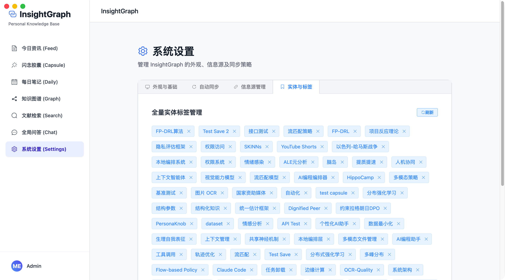

<div align="center">
  

  <h1>🌌 InsightGraph</h1>

  <p><b>一个高度智能化、自动化的个人第二大脑系统</b></p>

  <p>
    
    
    
    
    
  </p>
</div>

<br/>

> **不再让你的知识成为信息孤岛。**
> 在 InsightGraph 里，每一篇论文、每一个截屏、每一闪而过的灵感，都将自动凝结成知识图谱中熠熠生辉的星辰，并随时等待你的召唤。通过前沿大模型与本地知识库的深度融合，InsightGraph 实现了从“信息收集”到“知识内化”的无缝闭环。

---

## ✨ 核心特性 (Core Features)

### 📡 知识发现 (Auto-Feed & Skim Reading)
- **🤖 全自动信息聚合**：基于 APScheduler 定时扫描 arXiv 前沿论文或 RSS 订阅源。
- **⚡ 一键泛读摘要**：调用 Dify 大模型，数秒内将万字长文提炼为 **3 个核心要点 (Key Takeaways)**，实现一目十行的极速初筛。
- **📚 原生文件沉浸阅读**：一键拉起高清 PDF/Word 预览，并支持在“原文件排版”与“AI 解析文本”间丝滑切换。

### ⚡️ 闪念胶囊 (Multi-Modal Capsules)
- **✍️ 所见即所得的极客编辑**：基于 ByteMD 打造的 Typora 级体验，支持 GitHub 风格语法、代码高亮与 LaTeX 公式实时渲染。
- **📎 全能文档解析**：支持将 **PDF、Word、Excel、PPT** 直接拖入入库。
- **👁️ 多模态视觉 OCR**：整合视觉大模型（如 Qwen-VL），支持 **`Ctrl+V` 直接粘贴图片**，自动提取表格、公式并生成精美 Markdown。

### 📅 每日笔记与块级引用 (Daily Notes & Block Reference)
- **🧠 AI 魔法重写 (AI Writer)**：沉浸式日记写作，支持 `[[capsule:id]]` 双链语法。AI 会自动读取原文数万字的 PDF 上下文，辅助您进行深度创作。
  - **双模式驱动**：支持“模板模式”与“完全自定义模式”。
  - **11 种预设模板**：涵盖润色、改写、扩写、压缩、生成大纲、提炼要点、行动清单、Q&A、记忆卡片及博客排版，随心所欲转换文风与结构。
  - **高级附加指令**：即使在模板模式下，也支持叠加自定义 Prompt（如“用莎士比亚风格重写”），实现精准的创作控制。
- **📚 AI 图书管理员 (AI Librarian)**：在您敲击键盘的瞬间，AI 会在后台实时（防抖）检索您的私有知识库。在侧边栏主动向您推荐与当前段落高度相关的历史胶囊、文献片段与灵感，彻底打破“记完就忘”的魔咒。
- **🎯 块级高亮引用 (Block-level Reference)**：
  - **文献高亮提取**：在阅读 PDF 或文献原文时，划选文字即可一键提取为带有溯源链接的“高亮胶囊”。
  - **键盘流极客引用**：写日记时连续输入 `((` 即可呼出块级引用搜索窗。支持直接插入文献高亮段落。这不仅大幅降低了大模型上下文 Token 消耗，更从根本上消除了 AI 重写时的幻觉。
- **🗂️ 智能拖拽分类树**：左侧边栏提供优雅的树形分类视图，支持鼠标拖拽 (Drag & Drop) 实现日记的极速无感归类。
- **✨ 个性化模仿学习 (Few-shot Learning)**：自动分类引擎不仅会在顶部提供 AI 推荐，还会自动“翻阅”您最近手动分类的历史记录，精准模仿您的分类风格和颗粒度。

### 🌌 动态知识图谱 (Knowledge Graph)
- **🧠 概念级高维聚类**：剔除无意义的连线，仅展示由 LLM 自动抽取的“核心专业概念”节点。
- **🔗 万物引力连线**：文献、闪念胶囊、每日笔记通过相同的手动或自动 Tag 自动聚拢，形成网状结构的跨模态知识图谱。
- **🚀 快捷穿梭与下钻**：点击图谱节点，呼出关联文献列表，一键拉起原生 PDF 阅读器，无缝下钻知识。

### 🤖 跨源全局问答 (Global Chat)
- **💬 打通数据孤岛**：专属全局 Chatbot 穿透你的“原文库”、“精读库”和“闪念胶囊库”。
- **⚡ 流式多模态交互**：极致流畅的 SSE 打字机响应，支持带附件/图文上传提问。
- **🎯 严格溯源机制**：机器人的每一个结论都会生成带有超链接的**引用来源 (Citations)**，彻底杜绝大模型幻觉。

### 💻 跨平台桌面端体验 (Desktop App)
- **🍏 原生级桌面应用**：基于 Electron 打包，告别浏览器标签页的束缚，享受纯粹、免干扰的第二大脑沉浸感。
- **🪟 独立窗口管理**：原生 PDF 独立窗口渲染、专属 Dock 图标、极致优雅的 UI 交互。
- **🎨 动态多主题系统 (Dynamic Themes)**：
  - **完美暗黑模式**：全站支持秒级切换深浅色调，保护视力。
  - **五大精美外观**：内置 科技紫(Default)、护眼森林(Forest)、复古拿铁(Latte)、极客纯黑(Geek) 以及基于 CSS `backdrop-filter` 打造的果味毛玻璃(Apple Glass) 拟物主题，提供商业级软件的主题切换体验。

---

## 📸 界面纵览 (Showcase)

<table align="center">
  <tr>
    <td align="center" width="50%">
      <b>1. 🖥️ 今日资讯与文献阅读 (Feed)</b><br/>
      
    </td>
    <td align="center" width="50%">
      <b>2. ⚡ 闪念胶囊 (Capsule)</b><br/>
      
    </td>
  </tr>
  <tr>
    <td align="center" width="50%">
      <b>3. 📅 每日笔记 (Daily Note)</b><br/>
      
    </td>
    <td align="center" width="50%">
      <b>4. 🌌 动态知识图谱 (Knowledge Graph)</b><br/>
      
    </td>
  </tr>
  <tr>
    <td align="center" width="50%">
      <b>5. 🔗 节点下钻与概念释义</b><br/>
      
    </td>
    <td align="center" width="50%">
      <b>6. 🤖 溯源级全局多模态问答 (Global Chat)</b><br/>
      
    </td>
  </tr>
  <tr>
    <td align="center" width="50%" colspan="2">
      <b>7. ⚙️ 全量实体与系统设置 (Settings)</b><br/>
      
    </td>
  </tr>
</table>

---

## 🛠 技术架构与生态树 (Tech Stack & Ecosystem)

InsightGraph 的架构设计崇尚“解耦、自动化与极致的视觉体验”。我们严选了当前最具生命力的开源框架来构建这套系统：

### 🎨 前端与桌面端 (Frontend & Desktop)
- **核心框架**: Vue 3 (Composition API) + TypeScript + Vite 5。
- **桌面端引擎**: **Electron** + Electron Builder。提供无缝的原生窗口体验与沙盒穿透能力。
- **UI 与视觉**: Element Plus + TailwindCSS 3。
- **沉浸式编辑器**: **ByteMD**。字节跳动开源的高性能 Markdown 编辑器，支持 GFM、代码高亮 (highlight.js) 与数学公式 (KaTeX)，并搭配了 `juejin-markdown-themes` 打造顶级阅读排版。
- **原生文档预览**: `@vue-office` 生态 (`docx`, `excel`, `pdf`, `pptx`)，实现无需转换的纯前端高清文档渲染。
- **动态图谱引擎**: Apache **ECharts** 6。负责驱动千万级知识节点与万物引力连线的流畅渲染。

### ⚙️ 核心业务后端 (Backend)
- **Web 框架**: **FastAPI**。基于 ASGI 提供极速并发的 REST API 与 SSE 流式数据推送服务。
- **ORM 与数据建模**: SQLAlchemy 2.0 + Pydantic v2。
- **高可用爬虫引擎**: HTTPX 结合 **Exponential Backoff (指数退避)** 算法，实现对外部文献库 (如 arXiv) 严格限流 429 的从容重试与防屏蔽拦截。
- **任务调度**: APScheduler。负责系统后台的文献拉取、定时摘要生成等守护进程。
- **文档解析矩阵**: `PyMuPDF` (底层 PDF 解析), `pdf2zh` (文档翻译), `python-docx/pptx` 等构建的强力解析管道。
- **第三方集成**: Lark (飞书) 官方 Python SDK，用于将知识卡片无缝推送到飞书工作流。

### 🧠 数据库与中间件 (Data & Middleware)
- **主关系库与向量引擎**: **PostgreSQL + PgVector**。利用 PgVector 插件，使 PG 完美兼顾了高维 RAG 知识向量检索与复杂关系型业务数据的存储。
- **高速缓存**: Redis 7。用于高频图谱数据缓存与流式会话状态保持。
- **工作流编排**: **n8n**。内置于 Docker 环境中的节点化自动化平台，可轻松定制对 arXiv、GitHub 的监控与飞书推送流。

### 🤖 AI 大脑核心 (The AI Engine)
- **大模型底座平台**: **Dify**。InsightGraph 所有的文本 Embedding、RAG 混合检索、多模态视觉 OCR 工作流以及具有记忆的 Chatbot 会话，均完全托管于本地或云端的 Dify 实例。这种设计使得你可以随时在 Dify 后台零代码无缝切换底层大模型（如 GPT-4o, Claude 3.5, Qwen, DeepSeek 等）。

---

## 🚀 快速开始 (Quick Start)

### 前置要求
1. 安装 **Docker** 和 **Docker Compose**。
2. 确保你已经部署好了一个 **Dify** 实例（本地 Docker 或云端服务皆可）。
3. 确保你已经安装了 Node.js（用于编译前端与打包 Electron）。

### 1. 环境与配置准备
在项目根目录，你会看到 `.env.example` 和 `docker-compose.example.yml` 两个模板文件。

**第一步：配置环境变量**
复制 `.env.example` 并重命名为 `.env`，然后填入你的 Dify API 凭证和自定义密码：
```bash
cp .env.example .env
```

**第二步：准备 Docker 配置**
复制 `docker-compose.example.yml` 并重命名为 `docker-compose.yml`。如果你在 `.env` 中修改了密码，请确保在此文件中同步修改占位符（如 `<YOUR_DB_PASSWORD>`）：
```bash
cp docker-compose.example.yml docker-compose.yml
```

### 2. 一键启动后端
在根目录执行一键部署脚本，或手动拉起 Docker：
```bash
docker compose up -d --build
```

### 3. 体验桌面端 App (推荐)
想要获得最佳的“第二大脑”沉浸体验，请进入 `frontend` 目录并打包桌面应用：
```bash
cd frontend
npm install
npm run electron:build
```
*编译完成后，可在 `frontend/dist_electron/` 中找到你专属的独立 App 安装包！*

### 4. 体验网页端
如果你更喜欢在浏览器中运行：
```bash
cd frontend
npm install
npm run dev
```
打开浏览器访问 [http://localhost:5173](http://localhost:5173) 即可。

### 5. 🛠️ AI 编排与自动化后台登录
本项目深度集成了 AI 工作流编排系统（Dify）与自动化集成平台（n8n），您可以通过以下本地地址直接登录并进行二次开发配置：

*   **🧠 Dify AI 大脑控制台**: 
    *   **地址**: [http://localhost](http://localhost) (或 http://127.0.0.1)
    *   **功能**: 在这里可视化创建大模型应用、管理 RAG 知识库、调试 Prompt，并获取 API Key 填入本项目的 `.env` 中。
*   **⚙️ n8n 自动化工作流后台**: 
    *   **地址**: [http://localhost:5678](http://localhost:5678)
    *   **账号/密码**: `admin` / `insight_admin_123` (可在 `.env` 中修改)
    *   **功能**: 通过拖拽节点实现自动抓取 RSS、监控 GitHub、定时向飞书/钉钉推送消息等自动化流水线。

---

## ⚙️ 系统维护与自定义
- **深色模式 (Dark Mode)**：在系统设置中一键切换，享受暗夜沉浸阅读。
- **数据抓取调度**：支持在 UI 界面手动触发 APScheduler，立即拉取 arXiv 最新文献。
- **知识图谱修剪**：可视化管理标签库，一键剔除大模型生成的冗余节点，保持图谱纯净。

## 📄 License
MIT License
