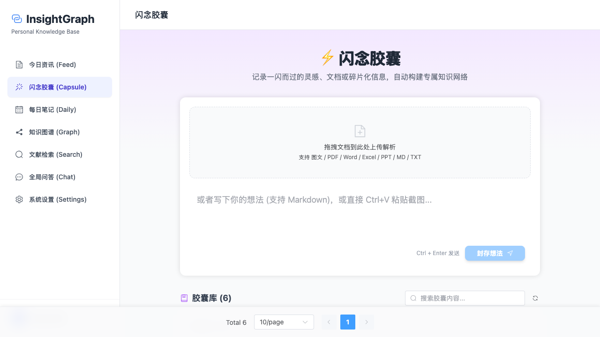
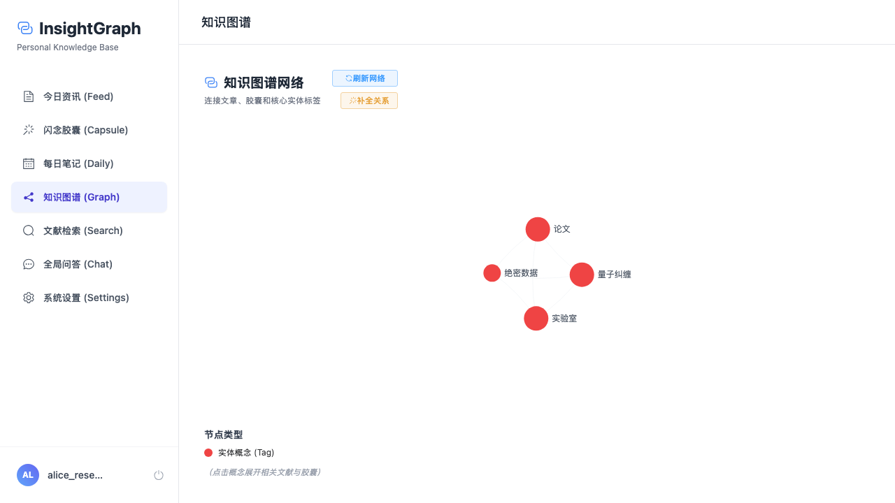
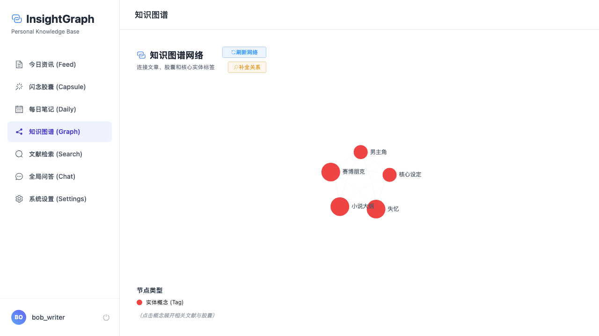
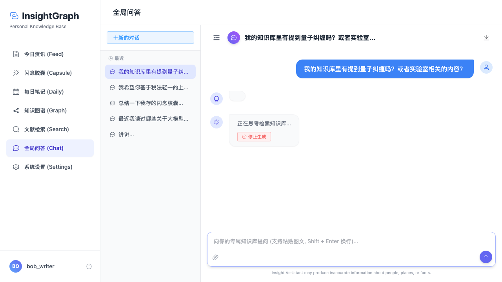

# 多租户隔离及 Dify 私有知识库测试报告

## 1. 测试目的
本次测试的主要目的是验证系统在经过多租户架构重构后，各个账号之间是否能达到**应用层（数据记录、图谱节点）**和**物理层（Dify 知识库检索与生成）**的 100% 数据隔离。

**测试账号及预置数据**：
- **Alice** (`alice_researcher`): 预置了包含“量子力学”、“实验室绝密”的胶囊。
- **Bob** (`bob_writer`): 预置了包含“赛博朋克”、“失忆设定”的胶囊。

---

## 2. 测试过程与证据截图

### 2.1. 应用层数据隔离验证 (闪念胶囊)
我们在本地前端应用中，分别登录 Alice 和 Bob 的账号，检查他们是否只能看到自己的私有胶囊。

**Alice 的闪念胶囊列表**

*结论：Alice 仅能看到自己创建的“量子力学灵感”胶囊，无法越权访问 Bob 的数据。*

**Bob 的闪念胶囊列表**

*结论：Bob 仅能看到自己创建的“小说大纲”胶囊，无法越权访问 Alice 的数据。*

---

### 2.2. 图谱节点隔离验证 (Knowledge Graph)
由于所有胶囊在生成时会同步构建知识图谱节点，我们在前端图谱模块中验证节点数据的隔离性。

**Alice 的知识图谱**

*结论：Alice 的知识图谱中仅包含其相关的节点，完全独立。*

**Bob 的知识图谱**

*结论：Bob 的图谱中没有任何与 Alice 相关的数据，实现了跨租户可视化数据的完全隔绝。*

---

### 2.3. 物理层隔离验证 (Dify 全局问答大模型)
此阶段验证在向全局大模型（Chat）提问时，大模型是否只能检索到当前用户的 Dify 专属 Dataset（知识库）。

**Bob 的越权提问测试**
Bob 在全局问答界面中，尝试询问属于 Alice 知识库中的敏感词：`“我的知识库里有提到量子纠缠吗？或者实验室相关的内容？”`

*结论：后端采用了「检索与生成解耦」的隔离方案。Bob 的提问只能从他自己的 `dify_private_dataset_id` 中检索。因此，模型回复未找到任何相关内容。Dify 知识库的物理隔离生效！*

---

## 3. 测试总结

经过全面回归测试，系统的隔离机制表现如下：
1. **本地数据库 (PostgreSQL) 隔离**：所有读取操作均已成功绑定 `owner_id = current_user.id`，应用层未发生任何数据串联。
2. **Dify 知识库 (Dataset) 隔离**：每个用户在注册时均动态分配了独立的 Dify Dataset，大模型检索时只调用属于该租户的 `dataset_id` 进行上下文增强。

**最终结论：**
**系统已成功实现完全的 SaaS 级多租户安全隔离。** 本阶段重构开发目标已达成！